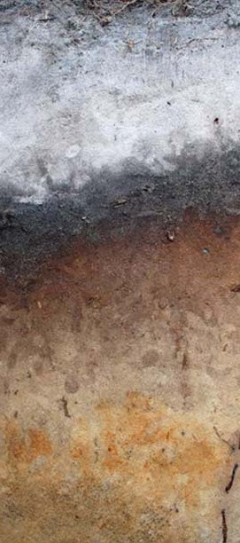
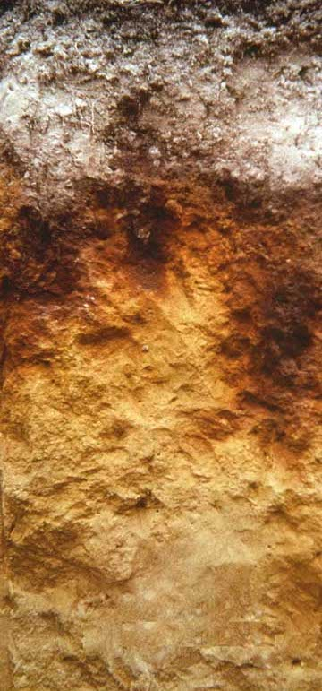
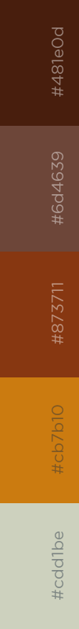
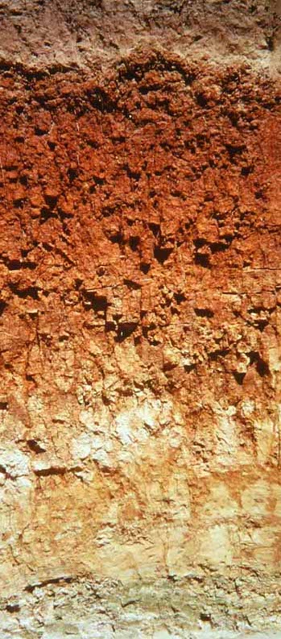
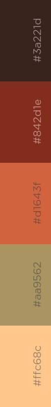

soilpalettes
================
Kaizad Patel

This package contains color palettes for RStudio, inspired by soil
profiles.  
Palettes created using [Coolors](https://coolors.co).

-----

### Palettes

**alaquod** Aeric Alaquod, NC.  
*source [University of Idaho -
CALS](https://www.uidaho.edu/cals/soil-orders)*  

**durorthod** Typic Durorthod  
*source [University of Idaho -
CALS](https://www.uidaho.edu/cals/soil-orders)*  

**paleustalf** Udic Paleustalf  
*source [University of Idaho -
CALS](https://www.uidaho.edu/cals/soil-orders)*  

-----

### building palettes

<!-- --><!-- --><!-- --><!-- -->
