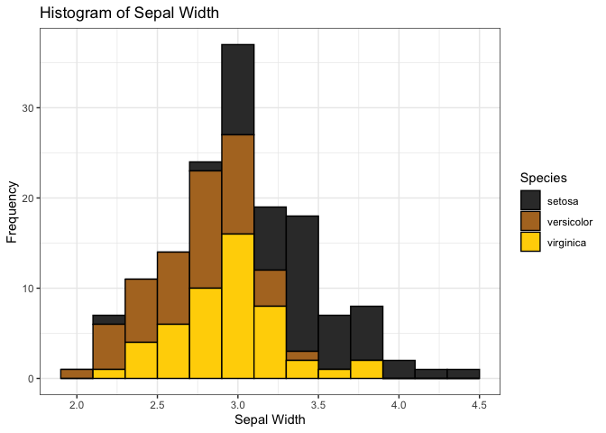
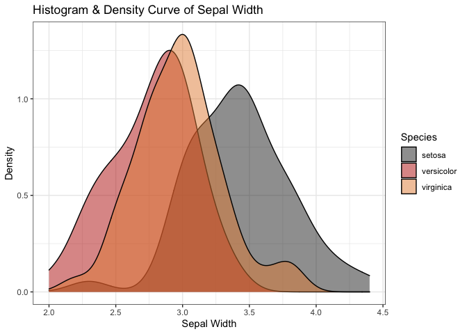

soilpalettes
================

This package contains color palettes for RStudio, inspired by soil
profiles.  
Palettes are colorblind-friendly and were created using
[Chroma.js](https://gka.github.io/palettes/) and
[Coolors](https://coolors.co).

Source images and color hex values can be found here.

-----

### install package

``` r
# install.packages("devtools") 
devtools::install_github("kaizadp/soilpalettes")
```

-----

### Palettes

#### soil orders and suborders

<!-- --><!-- --><!-- --><!-- -->

#### soil series

<!-- -->

-----

### Usage

``` r
library(ggplot2)

ggplot(data=iris, aes(x=Sepal.Width, fill = Species))+
  geom_histogram(binwidth=0.2, color="black") + 
  xlab("Sepal Width") +  ylab("Frequency") + 
  ggtitle("Histogram of Sepal Width") + theme_bw()+
  
  scale_fill_manual(values = soil_palette("rendoll",3))
```

<!-- -->

``` r
ggplot(data=iris, aes(x=Sepal.Width, fill=Species)) + 
  geom_density(stat="density", alpha=(0.5)) +
  xlab("Sepal Width") +  ylab("Density") + 
  ggtitle("Histogram & Density Curve of Sepal Width") + theme_bw()+
  
  scale_fill_manual(values = soil_palette("paleustalf",3))
```

<!-- -->
