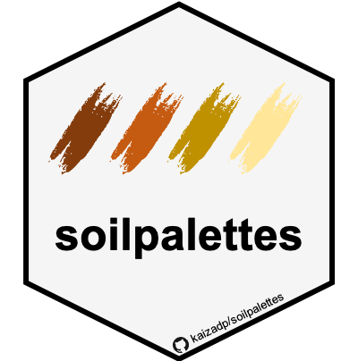
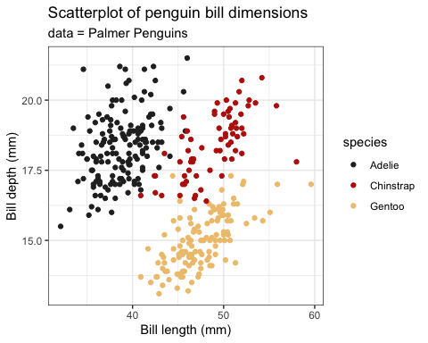

# soilpalettes

<!-- badges: start -->

[](https://zenodo.org/badge/latestdoi/257353182)
[](https://github.com/kaizadp/soilpalettes/actions)
<!-- badges: end -->

This package contains color palettes for RStudio, inspired by soil
profiles. Palettes are colorblind-friendly and were created using
[Chroma.js](https://gka.github.io/palettes/) and
[Coolors](https://coolors.co).  
Source images and color hex values can be found in the
[`images.md`](https://github.com/kaizadp/soilpalettes/blob/master/images.md)
file in the root directory.

#### install package

``` r
# install.packages("devtools") 
devtools::install_github("kaizadp/soilpalettes")
```

-----

### Palettes

#### soil orders, suborders, and great groups

<!-- --><!-- --><!-- --><!-- --><!-- --><!-- --><!-- --><!-- -->

#### soil series

<!-- --><!-- -->

#### others

<!-- --><!-- --><!-- --><!-- -->

-----

### Usage

``` r
library(ggplot2)

ggplot(data=iris, aes(x=Sepal.Width, fill = Species))+
  geom_histogram(binwidth=0.2, color="black") + 
  xlab("Sepal Width") +  ylab("Frequency") + 
  ggtitle("Histogram of Sepal Width") + theme_bw()+
  
  scale_fill_manual(values = soil_palette("rendoll",3))
```

<!-- -->

``` r
ggplot(data=iris, aes(x=Sepal.Width, fill=Species)) + 
  geom_density(stat="density", alpha=(0.6)) +
  xlab("Sepal Width") +  ylab("Density") + 
  ggtitle("Histogram & Density Curve of Sepal Width") + theme_bw()+
  
  scale_fill_manual(values = soil_palette("paleustalf",3))
```

<!-- -->

``` r
library(palmerpenguins)

ggplot(penguins, aes(x = bill_length_mm, y = bill_depth_mm, color = species))+
  geom_point()+ 
  labs(x = "Bill length (mm)", y = "Bill depth (mm)",
       title = "Scatterplot of penguin bill dimensions",
       subtitle = "data = Palmer Penguins")+
  theme_bw()+
  
  scale_color_manual(values = soil_palette("paleustalf", 3)) 
```

<!-- -->

``` r
ggplot(penguins, aes(y = body_mass_g, x = species, fill = species))+
  geom_violin(alpha = 0.5)+ 
  geom_dotplot(binaxis = "y", color = "black", fill="black", dotsize=0.3, stackdir = "center", binpositions="all")+
  labs(y = "Body mass (g)", x = "",
       title = "Violin plot of penguin body mass",
       subtitle = "data = Palmer Penguins")+
  theme_bw()+
  
  scale_fill_manual(values = soil_palette("podzol", 3)) 
```

<!-- -->

``` r
ggplot(penguins, aes(x = bill_length_mm, y = bill_depth_mm, color = bill_length_mm))+
  geom_point()+ 
  labs(x = "Bill length (mm)", y = "Bill depth (mm)",
       title = "Scatterplot of penguin bill dimensions",
       subtitle = "data = Palmer Penguins")+
  theme_bw()+
  
  scale_color_gradientn(colors = rev(soil_palette("redox2",5))) 
```

<!-- -->

-----

Code structure was modelled after the
[`PNWColors`](https://github.com/jakelawlor/PNWColors) and
[`wesanderson`](https://github.com/karthik/wesanderson) packages.
Contribute soil palettes in the
[issues](https://github.com/kaizadp/soilpalettes/issues/6)
