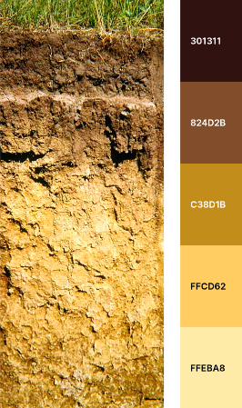
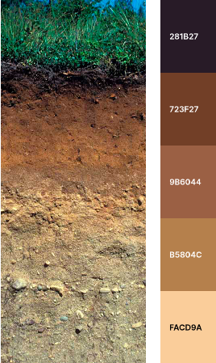
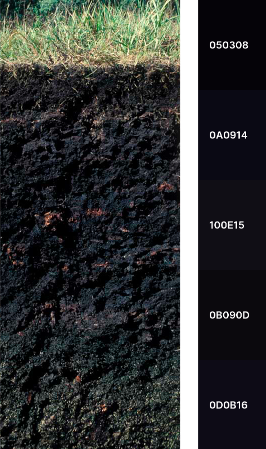

These are the soil profiles that inspired the color palettes.
Color palettes were created using [Chroma.js](https://gka.github.io/palettes/) and [Coolors](https://coolors.co).  

----

**alaquod** Aeric Alaquod, NC.   
*source [University of Idaho - CALS](https://www.uidaho.edu/cals/soil-orders)*  
 

**durorthod** Typic Durorthod  
*source [University of Idaho - CALS](https://www.uidaho.edu/cals/soil-orders)*  
 

**natrudoll**   
*source [University of Idaho - CALS](https://www.uidaho.edu/cals/soil-orders)*  
 

**paleustalf** Udic Paleustalf  
*source [University of Idaho - CALS](https://www.uidaho.edu/cals/soil-orders)*  
 

**rendoll**   
*source [University of Idaho - CALS](https://www.uidaho.edu/cals/soil-orders)*  
 

**vitrixerand**   
*source [University of Idaho - CALS](https://www.uidaho.edu/cals/soil-orders)*  
 

**bangor** Bangor series (Typic Haplorthods, Maine USA)   
 

**pywell**  Pywell series (Typic Haplosaprist,  Idaho USA)  
*source [University of Idaho - CALS](https://www.uidaho.edu/cals/soil-orders)*  
 

