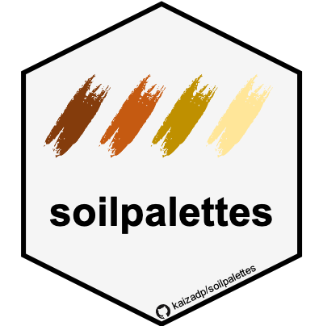

```{r echo=FALSE}
knitr::opts_chunk$set(
  collapse = TRUE,
  echo=FALSE,
  message = FALSE,
  warning = FALSE,
  error = FALSE,
  comment = "#>",
  fig.height = 1
)
```



# soilpalettes

This package contains color palettes for RStudio, inspired by soil profiles.
Palettes are colorblind-friendly and were created using [Chroma.js](https://gka.github.io/palettes/) and [Coolors](https://coolors.co).  
Code structure was modelled after the [`PNWColors`](https://github.com/jakelawlor/PNWColors) and [`wesanderson`](https://github.com/karthik/wesanderson) packages.


Source images and color hex values can be found in the  [`images.md`](https://github.com/kaizadp/soilpalettes/blob/master/images.md) file in the root directory. 

----

### install package

```{r echo = TRUE, message=FALSE,warning=FALSE}
# install.packages("devtools") 
devtools::install_github("kaizadp/soilpalettes")
```

----

----


### Palettes
#### soil orders, suborders, and great groups
```{r orders, echo = FALSE}
library(soilpalettes)

soil_palette(name="alaquod")
soil_palette(name="durorthod")
soil_palette(name="paleustalf")
soil_palette(name="rendoll")

```

#### soil series
```{r series, echo = FALSE}
soil_palette(name="bangor")
```

----

### Usage

```{r usage1, fig.height=5, echo=TRUE}
library(ggplot2)

ggplot(data=iris, aes(x=Sepal.Width, fill = Species))+
  geom_histogram(binwidth=0.2, color="black") + 
  xlab("Sepal Width") +  ylab("Frequency") + 
  ggtitle("Histogram of Sepal Width") + theme_bw()+
  
  scale_fill_manual(values = soil_palette("rendoll",3))
```

```{r usage2, fig.height=5, echo=TRUE}
ggplot(data=iris, aes(x=Sepal.Width, fill=Species)) + 
  geom_density(stat="density", alpha=(0.6)) +
  xlab("Sepal Width") +  ylab("Density") + 
  ggtitle("Histogram & Density Curve of Sepal Width") + theme_bw()+
  
  scale_fill_manual(values = soil_palette("paleustalf",3))

```

